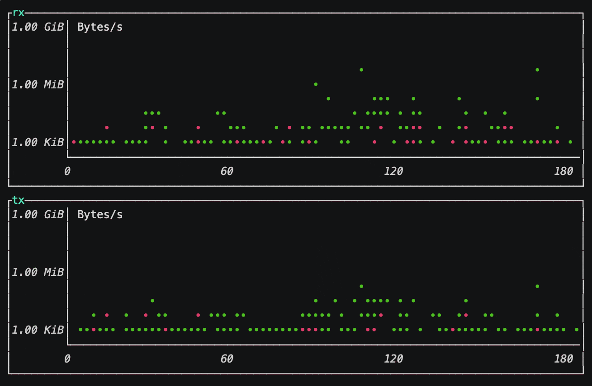

# mone

[](https://travis-ci.org/gky360/mone)
[](https://crates.io/crates/mone)
[](https://docs.rs/mone)

Network monitoring tool written in Rust.



## Requirements

- Linux / OS X

## Installation

You can use [`install.sh`](https://github.com/gky360/mone/blob/master/install.sh) to install binary release.

```
$ curl -sSf -L https://raw.githubusercontent.com/gky360/mone/master/install.sh | sh
```

Or you can install mone using cargo.

```
$ cargo install mone
```

## Usage

Start mone with the `mone` command.

```
$ mone
```

To stop mone use `q` , or `ctrl+c` in most shell environments.

mone consists of a Reader and a Writer.
Readers collect network stats on your machine.
Writers output the network stats collected by a Reader.
Available Readers and Writers are as follows.

- Reader
    - libc (default) ... Get traffic of each network interface using libc's `getifaddr` function.
- Writer
    - tui (default) ... Output results in Terminal User Interface (TUI) mode.
    - simple ... Output results in a simple log format.

Reader and Writer can be specified via command options.
See `mone --help` for more details.

## License

Released under [the MIT license](LICENSE).
